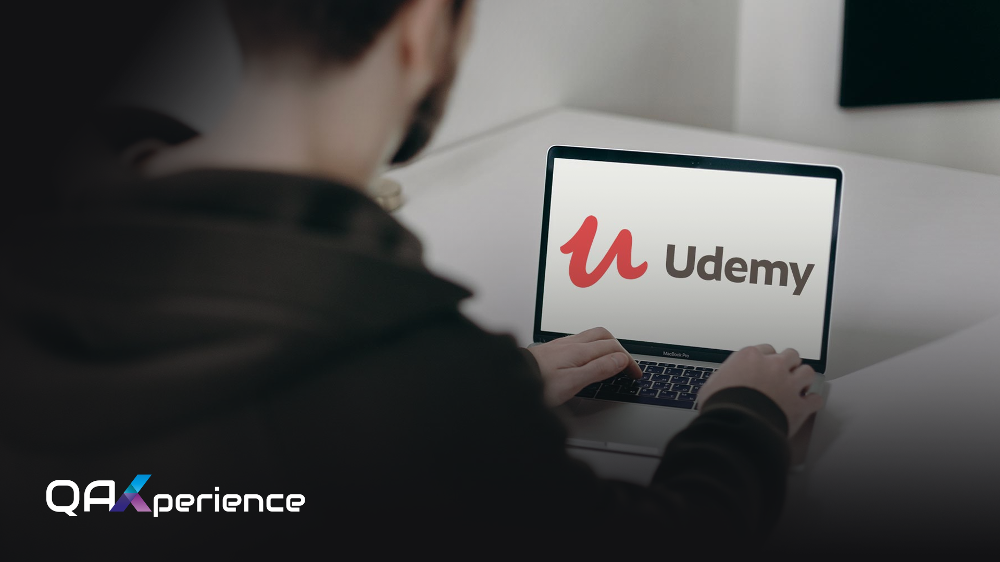

## Passo a Passo para Acessar o Curso na Udemy 🚀

**1. Acesso à Plataforma QAx**

- Primeiramente, acesse a plataforma QAx através do [link fornecido](https://qax.eveclass.com/pt/auth/entrar) 🔗.
- Faça o login utilizando suas credenciais de aluno(a) 👩‍🎓👨‍🎓.

**2. Selecionar o Curso**

- Após efetuar o login, navegue até a seção de cursos adquiridos.
- Escolha o curso que deseja assistir.

**3. Acesso ao Curso na Udemy**

- Dentro do curso selecionado, localize o primeiro módulo.
- Procure pela aula intitulada "Assista na Udemy" e clique no link de resgate disponibilizado.
- Este processo não terá custo adicional para você.

**4. Procedimentos na Udemy**

- Ao ser redirecionado para a Udemy, siga os passos indicados para resgatar o curso.
- Caso não tenha uma conta na Udemy, será necessário criar uma.
- Após o resgate bem-sucedido, você poderá assistir ao curso na plataforma da Udemy, utilizando todas as suas funcionalidades.
